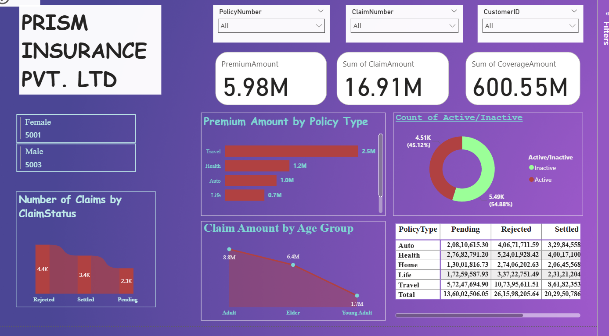

# 📊 PRISM Insurance Pvt. Ltd. - Insurance Analysis Dashboard

An end-to-end **Power BI project** analyzing insurance claims data to uncover insights on business performance, customer behavior, and operational efficiency. This dashboard enables stakeholders to make data-driven decisions through visual storytelling, KPIs, and drill-through analytics.

---

## 🧠 Project Overview

This project involves:
- Cleaning and transforming raw insurance data
- Building a reliable star schema model
- Developing insightful KPIs and DAX measures
- Designing a dynamic, role-based interactive dashboard in Power BI

---

## 💡 Key Skills & Features Implemented

### 1️⃣ Data Transformation (Power Query)
- Cleaned and profiled raw data, handled nulls and inconsistencies
- Standardized data types and formats
- Created custom columns for **age group classification** and **policy categories**

### 2️⃣ Data Modeling
- Built a **Star Schema** with one central Fact table and multiple Dimensions (Customer, Policy, Calendar)
- Defined proper relationships, cardinality, and optimized data load for performance

### 3️⃣ Advanced DAX Measures
- Computed key performance indicators (KPIs):
  - Total Premium, Claim Amount, Coverage
  - Claim Rate, Rejection Rate, Customer Retention
- Integrated **Time Intelligence** functions:
  - `TOTALYTD()`, `SAMEPERIODLASTYEAR()`, `DATEADD()`

### 4️⃣ Sentiment Analysis (AI Insights)
- Leveraged **Text Analytics** in Power Query to process unstructured customer feedback (Premium Feature)
- Mapped scores to categories: **Positive**, **Negative**, **Neutral**
- Visualized overall satisfaction and policy-specific sentiment

### 5️⃣ Row-Level Security (RLS)
- Implemented **dynamic RLS** using `USERPRINCIPALNAME()` for secure access
- Created role-based dashboards for **Regional Managers**, **Claim Agents**, etc.

### 6️⃣ Interactive Visualization & Reporting
- Designed an app-like, interactive report layout
- Used **slicers, filters, bookmarks, buttons, tooltips**, and page navigation for a smooth user experience
- Provided real-time exploration of metrics by **gender, age group, policy type, and claim status**

---

## 📷 Dashboard Preview

### Key Dashboard Elements:
- **Total Premium**, **Claim**, and **Coverage Amounts**
- **Policy Type vs Premium**
- **Claim Amount by Age Group**
- **Claim Status Breakdown (Pending, Settled, Rejected)**
- **Active vs Inactive Customers**
- **Gender-wise Distribution**
- **Interactive Filters:** Policy Number, Customer ID, Claim Number

---

